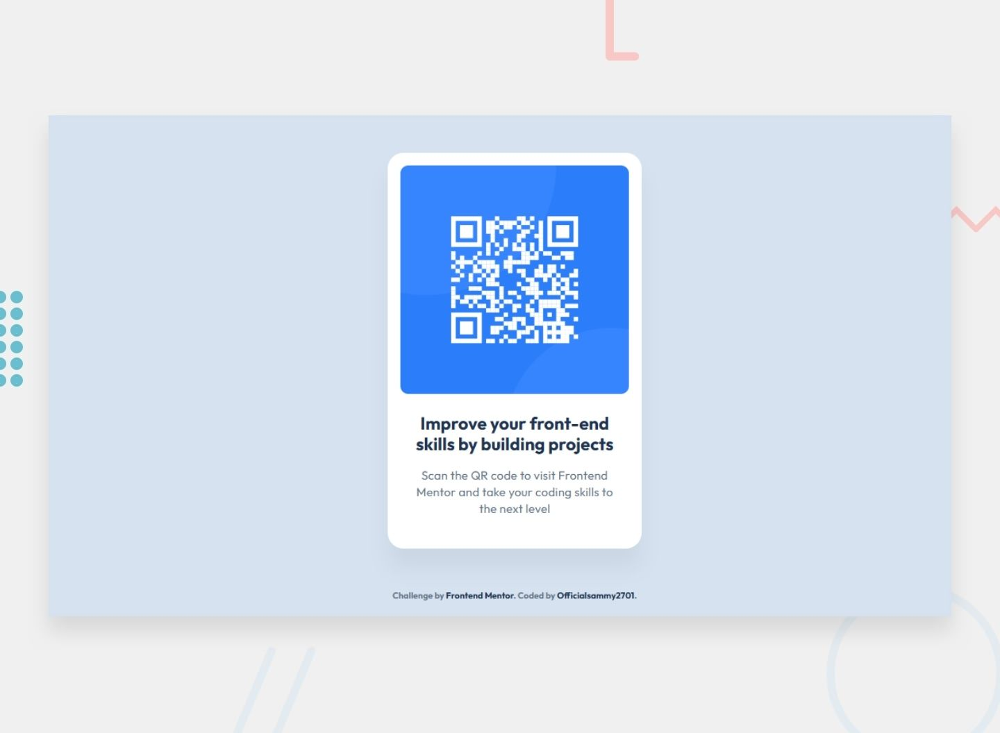

# Frontend Mentor - QR code component solution

This is a solution to the [QR code component challenge on Frontend Mentor](https://www.frontendmentor.io/challenges/qr-code-component-iux_sIO_H). Frontend Mentor challenges help you improve your coding skills by building realistic projects. 

## Table of contents

- [Overview](#overview)
  - [Screenshot](#screenshot)
  - [Links](#links)
- [My process](#my-process)
  - [Built with](#built-with)
  - [What I focused on](#what-i-focused-on)
  - [Continued development](#continued-development)
- [Author](#author)
- [Acknowledgments](#acknowledgments)

## Overview

A responsive single-card layout built with semantic HTML and modern CSS. The goal was to match the supplied mobile and desktop designs closely while keeping the code clean, accessible, and easy to maintain.

### Screenshot

### Links

- Solution URL: [Solution URL](https://www.frontendmentor.io/solutions/qr-code-component-iux-e81ABCpxxf)
- Live Site URL: [Live Site URL](https://officialsammy2701.github.io/qr-code-component-iux/)

## My process

## Built with

- Semantic HTML5 markup
- CSS custom properties
- Mobile-first workflow
- CSS Grid for page centering

## What I focused on

- Matching the card width, spacing, border radius, and typography from the design
- Building a responsive layout that works from small mobile widths up to large desktop screens
- Using accessible markup with a proper heading hierarchy and meaningful image alt text
- Keeping the solution simple and challenge-appropriate without unnecessary complexity

## Author

- Website - [Ismail Akande](https://github.com/Officialsammy2701)
- Frontend Mentor - [@Officialsammy2701](https://www.frontendmentor.io/profile/Officialsammy2701)
- Twitter - [@sammy_2701](https://x.com/sammy_2701)

## Acknowledgments

This project was built as part of a challenge from [Frontend Mentor](https://www.frontendmentor.io), which helped me practice building responsive layouts and writing clean, maintainable code.
